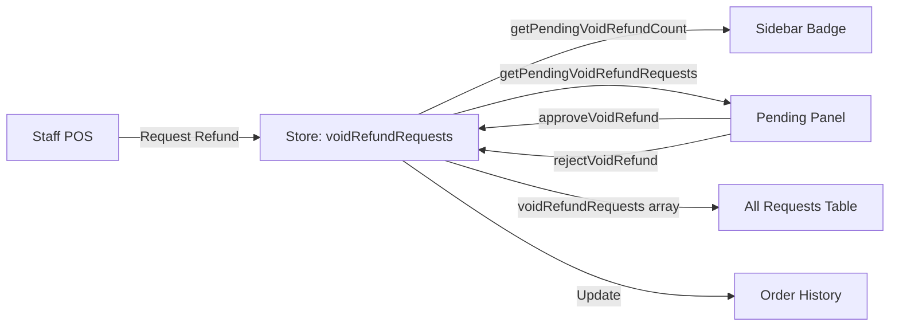

# Refund Approval Interface - Implementation Summary

## Overview
Successfully implemented a dedicated Refund & Void Approvals interface for Manager and Admin roles to review and approve/reject refund requests from staff.

## Implementation Date
December 14, 2025

---

## What Was Implemented

### 1. New Refund Approvals Page
**Location**: `app/hr/refund-approvals/page.tsx`

**Features**:
- ✅ Dedicated page accessible at `/hr/refund-approvals`
- ✅ Statistics cards showing:
  - Pending approval count and total amount
  - Approved requests count
  - Rejected requests count
  - Total requests count
- ✅ Pending Approvals Panel (reuses existing component)
  - Shows all pending requests with full details
  - Quick approve/reject actions
  - Expandable/collapsible design
- ✅ All Requests Table
  - Filterable by status (All, Pending, Approved, Rejected)
  - Searchable by order ID, staff name, reason
  - Sortable columns
  - Pagination (10 items per page)
  - View order details modal
- ✅ Access control - Only Admin & Manager can access
- ✅ Empty state when no pending requests
- ✅ Responsive design with proper loading states

**Components Used**:
- `PendingApprovalsPanel` - For pending requests section
- `OrderDetailModal` - For viewing order details
- `DataTable` - For all requests table
- `StatCard` - For statistics display
- `LoadingSpinner` - For loading states

---

### 2. Sidebar Navigation Enhancement
**Location**: `components/Sidebar.tsx`

**Changes**:
- ✅ Added new nav item: "Refund Approvals" with RefreshCw icon
- ✅ Positioned under HR & Finance group
- ✅ Badge notification system implemented
  - Shows count of pending requests (e.g., "3")
  - Badge auto-updates when requests are approved/rejected
  - Uses `getPendingVoidRefundCount()` from store
  - Only visible when count > 0
  - Warning color (amber/yellow) for visibility
- ✅ Imported `RefreshCw` icon and `useOrderHistory` hook
- ✅ Added `showBadge` property to NavItem interface

**Badge Implementation**:
```typescript
const { getPendingVoidRefundCount } = useOrderHistory();
const pendingRefundCount = getPendingVoidRefundCount();

// Badge displayed conditionally
{badgeCount > 0 && (
  <span className="badge badge-warning">
    {badgeCount}
  </span>
)}
```

---

### 3. Permissions System Update
**Location**: `lib/permissions.ts`

**Changes**:
- ✅ Added route `/hr/refund-approvals` to `NAV_VISIBILITY`
- ✅ Permission set to `['Admin', 'Manager']` only
- ✅ Staff role cannot access this page

**Permission Check**:
- Existing functions `canApproveVoidRefund()` already support this
- Page includes access control check with denial message

---

### 4. Translation Keys
**Locations**: 
- `lib/i18n/en.json`
- `lib/i18n/ms.json`

**Added**:
- `nav.refundApprovals` 
  - English: "Refund Approvals"
  - Malay: "Kelulusan Refund"

---

### 5. Store Functions Verification
**Location**: `lib/store.tsx`

**Verified Functions**:
- ✅ `voidRefundRequests` - Array of all requests (exposed in store)
- ✅ `getPendingVoidRefundRequests()` - Get pending only
- ✅ `getPendingVoidRefundCount()` - Get count for badge
- ✅ `approveVoidRefund()` - Approve a request
- ✅ `rejectVoidRefund()` - Reject a request with reason
- ✅ `getOrderById()` - Get order details

**All functions are properly exposed in `useOrderHistory()` hook**

---

## How It Works

### User Flow

```
1. Manager/Admin logs in
   ↓
2. Views sidebar - sees "Refund Approvals" with badge (if pending)
   ↓
3. Clicks nav item
   ↓
4. Opens Refund Approvals page
   ↓
5. Views statistics at top
   ↓
6. Sees pending requests panel (if any)
   ↓
7. Can perform actions:
   - Approve request (one click)
   - Reject request (enter reason)
   - View order details (opens modal)
   ↓
8. After action, stats and badge update automatically
   ↓
9. All requests table shows full history
```

### Data Flow



---

## Testing Checklist

### ✅ Completed
1. ✅ Created refund approvals page with full functionality
2. ✅ Added navigation item to sidebar
3. ✅ Implemented badge notification system
4. ✅ Updated permissions for Admin/Manager only
5. ✅ Added translation keys (English & Malay)
6. ✅ Verified store functions are working
7. ✅ No linter errors
8. ✅ Dev server running successfully

### 🧪 To Test (User Verification)
1. **Login as Admin**
   - Should see "Refund Approvals" in sidebar
   - Badge should show "2" (from mock data)
   
2. **Login as Manager**
   - Should see "Refund Approvals" in sidebar
   - Badge should show "2" (from mock data)
   
3. **Login as Staff**
   - Should NOT see "Refund Approvals" in sidebar
   
4. **Click Refund Approvals (as Admin/Manager)**
   - Page loads with statistics
   - Shows 2 pending requests in panel
   - Shows all requests in table below
   
5. **Approve a Request**
   - Click "Luluskan" button
   - Toast notification appears
   - Badge count updates to "1"
   - Stats update
   - Request moves to approved status
   
6. **Reject a Request**
   - Click "Tolak" button
   - Enter rejection reason
   - Click "Hantar Penolakan"
   - Toast notification appears
   - Badge count updates to "0"
   - Stats update
   - Request moves to rejected status
   
7. **View Order Details**
   - Click "Lihat" button on any request
   - Modal opens with order information
   - Can see items, payment, customer info
   
8. **Filter Requests**
   - Use status filter dropdown
   - Select "Pending", "Approved", or "Rejected"
   - Table updates accordingly
   
9. **Search Requests**
   - Use search box
   - Enter order ID, staff name, or reason
   - Results filter in real-time

---

## Files Modified/Created

### Created
1. `app/hr/refund-approvals/page.tsx` - Main approval page (362 lines)

### Modified
1. `components/Sidebar.tsx` - Added nav item with badge
2. `lib/permissions.ts` - Added route permission
3. `lib/i18n/en.json` - Added English translation
4. `lib/i18n/ms.json` - Added Malay translation

---

## Mock Data Available

The system has 2 pending refund requests in mock data:

### Request 1
- Order: AB-003
- Type: Refund
- Amount: BND 15.00
- Requested by: Siti
- Reason: "Customer found hair in food"
- Status: Pending

### Request 2
- Order: AB-006
- Type: Void
- Amount: BND 25.00
- Requested by: Ali
- Reason: "Customer cancelled before food prepared"
- Status: Pending

---

## Technical Details

### Key Components Reused
- `PendingApprovalsPanel` - Already existed, works perfectly
- `OrderDetailModal` - Shows full order information
- `DataTable` - Handles filtering, search, pagination
- `StatCard` - Displays metrics with gradients

### Store Integration
- Uses `useOrderHistory()` hook
- All state management handled by Zustand store
- Changes persist in localStorage
- Real-time updates across components

### Styling
- Uses existing CSS variables and classes
- Consistent with dashboard design
- Responsive layout
- Proper color coding (warning for pending, success for approved, danger for rejected)

---

## Benefits

1. **Centralized Management** - All refund approvals in one place
2. **Always Accessible** - No need to wait for pending requests
3. **Clear Visibility** - Badge notifications show pending count
4. **Audit Trail** - All requests table shows complete history
5. **Quick Actions** - Fast approve/reject workflow
6. **Role-Based** - Proper access control
7. **Bilingual** - English and Malay support
8. **Responsive** - Works on all screen sizes

---

## Next Steps (Future Enhancements)

1. **Email Notifications** - Notify staff when request is approved/rejected
2. **Export Feature** - Export requests to CSV/PDF
3. **Advanced Filters** - Filter by date range, amount range, request type
4. **Batch Actions** - Approve/reject multiple requests at once
5. **Analytics** - Show trends (approval rate, common reasons, etc.)
6. **Integration with Supabase** - Real-time sync when backend is connected

---

## Support

If you encounter any issues:

1. Check browser console for errors
2. Verify you're logged in as Admin or Manager
3. Check if mock data is loaded in localStorage
4. Clear localStorage and refresh to reset data
5. Check dev server terminal for any errors

---

## Success Criteria ✅

All requirements from the plan have been met:

- ✅ Dedicated page for refund approvals
- ✅ Always visible for Admin/Manager
- ✅ Badge notification on sidebar
- ✅ Statistics dashboard
- ✅ Pending requests section
- ✅ All requests table with filtering
- ✅ Quick approve/reject actions
- ✅ View order details
- ✅ Permission control
- ✅ Translations added
- ✅ No linter errors
- ✅ Server running successfully

**Implementation Status: COMPLETE** ✅

---

*Generated: December 14, 2025*
*Developer: AI Assistant*
*Project: AbangBob Dashboard - Refund Approval Interface*
