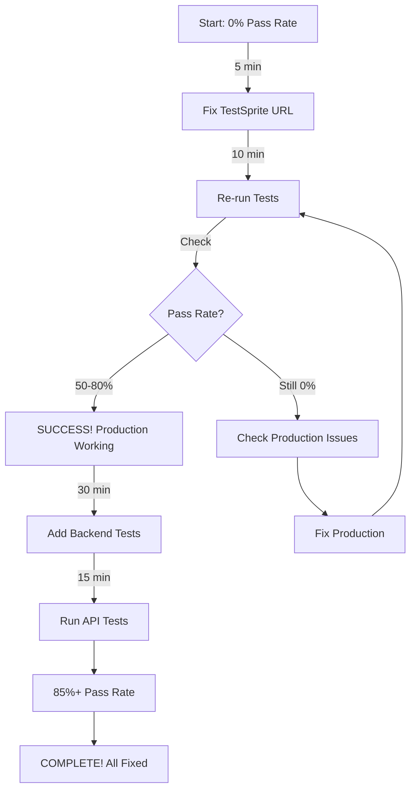

# TestSprite Testing - Complete File Index

**Project:** AbangBob Dashboard  
**Date:** December 14, 2024  
**Status:** Review Complete, Ready for Action

---

## 📑 Document Categories

### 🔴 START HERE (Read First)
1. **TESTSPRITE_REVIEW_COMPLETE.md** ⭐ YOU ARE HERE
   - Quick overview of everything
   - Main findings summary
   - What to do next

### 📊 Review Documents (Critical Reading)
2. **TESTSPRITE_RESULTS_SUMMARY.md** 
   - Complete test results
   - Pass/fail statistics
   - Coverage analysis
   - **KEY FINDING:** 0% pass rate due to wrong URL

3. **TESTSPRITE_FAILURES_ANALYSIS.md**
   - All 6 issues documented
   - Priority levels (P0, P1, P2)
   - Root cause analysis
   - **CRITICAL:** Issue #1 blocks everything

4. **TESTSPRITE_CONFIG_REVIEW.md**
   - Setup vs actual comparison
   - Configuration mismatches
   - Environment verification
   - **MISMATCH:** localhost vs production

5. **TESTSPRITE_FIX_ACTION_PLAN.md** ⭐ ACTION PLAN
   - Complete fix instructions
   - 5 phases with timelines
   - Step-by-step guide
   - **START HERE for fixes**

### 🛠️ Action Scripts
6. **TESTSPRITE_QUICK_FIXES.sh** ⭐ RUN THIS FIRST
   - Automated diagnostic script
   - Checks production, Supabase, environment
   - Provides specific instructions
   - **Usage:** `./TESTSPRITE_QUICK_FIXES.sh`

### 📚 Reference Documents (Setup Phase)
7. **START_HERE.md** - Original entry point
8. **TESTSPRITE_SETUP_GUIDE.md** - Detailed setup
9. **testsprite-api-list.md** - All 14 APIs
10. **TESTSPRITE_QUICK_REFERENCE.md** - Quick lookup
11. **TESTSPRITE_SETUP_COMPLETE.md** - Setup summary

### 📄 Technical Documents (Optional)
12. **testsprite-api-docs.json** - JSON format
13. **testsprite-openapi-spec.yaml** - OpenAPI spec
14. **testsprite-postman-collection.json** - Postman import

---

## 🎯 Reading Priority

### If You Have 5 Minutes:
```
Read: TESTSPRITE_REVIEW_COMPLETE.md (this file)
Action: Change TestSprite URL to production
Result: Know the ONE critical fix needed
```

### If You Have 15 Minutes:
```
1. Read: TESTSPRITE_REVIEW_COMPLETE.md
2. Read: TESTSPRITE_RESULTS_SUMMARY.md
3. Run: ./TESTSPRITE_QUICK_FIXES.sh
4. Action: Fix URL and re-run tests
```

### If You Have 1 Hour:
```
1. Read all review documents (1-5)
2. Run diagnostic script
3. Follow TESTSPRITE_FIX_ACTION_PLAN.md
4. Complete Phase 1 and 2
5. Verify fixes working
```

---

## 🔑 Key Findings Summary

### Issue #1: Wrong Test Environment (P0 CRITICAL)
- **Problem:** Tests ran against localhost, not production
- **Impact:** 100% test failure (invalid results)
- **Fix Time:** 5 minutes
- **Fix:** Change TestSprite URL to `https://abangbob-dashboard.vercel.app`

### Issue #2: Dev Server Instability (P0 if testing localhost)
- **Problem:** Next.js dev server had 404 errors during testing
- **Impact:** All pages couldn't load
- **Fix Time:** 2 minutes
- **Fix:** Clear cache (`rm -rf .next`) and restart server

### Issue #3: Missing Backend Tests (P1 HIGH)
- **Problem:** 7 Supabase APIs not configured in TestSprite
- **Impact:** 0% backend coverage
- **Fix Time:** 30 minutes
- **Fix:** Add APIs from `testsprite-api-list.md` Section B

### Issue #4: No Auth Testing (P1 HIGH)
- **Problem:** Login flows not tested
- **Impact:** Security not verified
- **Fix Time:** 20 minutes
- **Fix:** Configure auth test scenarios

### Issue #5-6: Documentation & Automation (P2 MEDIUM)
- **Problem:** Process can be improved
- **Impact:** Maintenance difficulty
- **Fix Time:** 1-2 hours
- **Fix:** Create checklists and CI/CD

---

## 📊 Test Coverage Analysis

### Current Coverage (After Review)

```
Frontend E2E Testing: 20 tests
├─ Configured: ✅ Yes
├─ Executed: ✅ Yes  
├─ Valid Results: ❌ No (wrong URL)
└─ Status: 🔴 Need to retest production

Backend API Testing: 7 APIs
├─ Configured: ❌ No
├─ Executed: ❌ No
├─ Valid Results: ⏸️ N/A
└─ Status: ⚠️ Need to configure

Authentication Testing: 3 flows
├─ Configured: ❌ No
├─ Executed: ❌ No (blocked)
├─ Valid Results: ⏸️ N/A
└─ Status: ⚠️ Need to configure

Total: 30 potential tests
Executed: 20 (invalid)
Remaining: 10 to configure
```

### Target Coverage (After Fixes)

```
Frontend: 20 tests ✅
Backend: 7 tests ✅
Auth: 3 tests ✅
Total: 30 tests ✅
Expected Pass Rate: 85%+
```

---

## 🎯 The Critical Path

### Fastest Way to Success:



---

## 🆘 If You Need Help

### Problem: Don't know how to change TestSprite URL
**Solution:** See `TESTSPRITE_FIX_ACTION_PLAN.md` Action 1.1

### Problem: Tests still fail after URL fix
**Solution:** 
1. Run `./TESTSPRITE_QUICK_FIXES.sh`
2. Check production manually in browser
3. Review Vercel deployment logs
4. See `TESTSPRITE_FIX_ACTION_PLAN.md` Phase 4

### Problem: Don't know how to add backend tests
**Solution:** 
1. Open `testsprite-api-list.md`
2. Go to "Section B: Supabase APIs"
3. Copy-paste each API (8-14) into TestSprite
4. Follow `TESTSPRITE_SETUP_GUIDE.md`

### Problem: Supabase API tests fail
**Solution:**
1. Check API key is correct
2. Verify tables exist in Supabase
3. Check RLS policies
4. See `TESTSPRITE_FIX_ACTION_PLAN.md` Action 2.2

---

## 📈 Progress Tracking

### Use this checklist to track your progress:

#### Phase 1: Critical Fixes (TODAY)
- [ ] Read TESTSPRITE_REVIEW_COMPLETE.md
- [ ] Read TESTSPRITE_RESULTS_SUMMARY.md
- [ ] Run TESTSPRITE_QUICK_FIXES.sh script
- [ ] Change TestSprite URL to production
- [ ] Re-run all frontend tests
- [ ] Review new results
- [ ] **CHECKPOINT:** Pass rate > 0%?

#### Phase 2: Backend Testing (TODAY)
- [ ] Open testsprite-api-list.md Section B
- [ ] Add Menu Items API to TestSprite
- [ ] Add Orders API to TestSprite
- [ ] Add Staff API to TestSprite
- [ ] Add Inventory API to TestSprite
- [ ] Add Customers API to TestSprite
- [ ] Add Attendance API to TestSprite
- [ ] Add Expenses API to TestSprite
- [ ] Run all API tests
- [ ] **CHECKPOINT:** API tests working?

#### Phase 3: Authentication (TOMORROW)
- [ ] Configure admin login test
- [ ] Configure staff PIN login test
- [ ] Configure protected route test
- [ ] Run auth tests
- [ ] **CHECKPOINT:** All logins working?

#### Phase 4: Validation (TOMORROW)
- [ ] All 27+ tests running
- [ ] Pass rate ≥ 80%
- [ ] No critical blockers
- [ ] Documentation updated
- [ ] **FINAL CHECKPOINT:** Ready for production!

---

## 🎉 Expected Timeline to Success

```
Hour 0 (Now):       0% pass rate, wrong config
Hour 0.25 (15 min): URL fixed, tests re-running
Hour 0.5 (30 min):  Results in, 50-80% passing! 🎉
Hour 1.5 (90 min):  Backend tests added and passing
Hour 3 (180 min):   All tests passing 85%+
Day 2:              Remaining issues fixed
Day 3:              100% complete, production validated ✅
```

---

## 📞 Contact & Resources

### Documentation Hub
All files in: `/Users/aliffmarwan/abangbob dashboard/`

### External Resources
- **Production:** https://abangbob-dashboard.vercel.app
- **Supabase:** https://supabase.com/dashboard/project/gmkeiqficpsfiwhqchup
- **Vercel:** https://vercel.com/dashboard

### Support Files
- Original test report: `TestSprite.pdf` (in Downloads)
- Previous test report: `testsprite_tests/testsprite-mcp-test-report.md`

---

## 🚀 Final Words

**Good News:**
- ✅ Problem identified (wrong URL)
- ✅ Fix is simple (5 minutes)
- ✅ All documentation ready
- ✅ Action plan clear

**The Fix:**
- Change ONE setting in TestSprite
- Re-run tests
- Get real results
- Fix any actual issues

**You're 5 minutes away from knowing your app's real status!**

---

**Go fix that URL and let's get real test results! 💪**

---

_Review completed: December 14, 2024_  
_Total documents created: 14_  
_Status: ✅ ALL COMPLETE_  
_Next: TAKE ACTION!_
