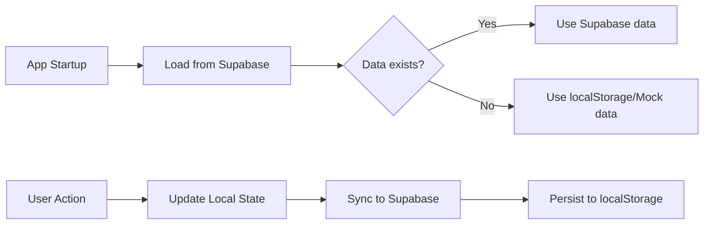

# Full Supabase Integration for Modifiers

## ✅ What Was Implemented

Full Supabase integration for **Modifier Groups** and **Modifier Options** with automatic sync.

### Changes Made:

1. **Database Schema** ([lib/supabase/schema.sql](lib/supabase/schema.sql))
   - ✅ Added `modifier_groups` table
   - ✅ Added `modifier_options` table
   - ✅ Added RLS policies
   - ✅ Added triggers for `updated_at`
   - ✅ Enabled realtime subscriptions

2. **TypeScript Types** ([lib/supabase/types.ts](lib/supabase/types.ts))
   - ✅ Added `modifier_groups` table types (Row, Insert, Update)
   - ✅ Added `modifier_options` table types (Row, Insert, Update)
   - ✅ Added convenience type aliases

3. **CRUD Operations** ([lib/supabase/operations.ts](lib/supabase/operations.ts))
   - ✅ `fetchModifierGroups()` - Get all groups
   - ✅ `insertModifierGroup()` - Create new group
   - ✅ `updateModifierGroup()` - Update existing group
   - ✅ `deleteModifierGroup()` - Delete group (cascades to options)
   - ✅ `fetchModifierOptions()` - Get all options
   - ✅ `insertModifierOption()` - Create new option
   - ✅ `updateModifierOption()` - Update existing option
   - ✅ `deleteModifierOption()` - Delete option

4. **Sync Functions** ([lib/supabase-sync.ts](lib/supabase-sync.ts))
   - ✅ `syncAddModifierGroup()` - Sync new group to Supabase
   - ✅ `syncUpdateModifierGroup()` - Sync group updates
   - ✅ `syncDeleteModifierGroup()` - Sync group deletion
   - ✅ `loadModifierGroupsFromSupabase()` - Load groups on init
   - ✅ `syncAddModifierOption()` - Sync new option
   - ✅ `syncUpdateModifierOption()` - Sync option updates
   - ✅ `syncDeleteModifierOption()` - Sync option deletion
   - ✅ `loadModifierOptionsFromSupabase()` - Load options on init
   - ✅ Updated `loadAllDataFromSupabase()` to include modifiers

5. **Store Integration** ([lib/store.tsx](lib/store.tsx))
   - ✅ Load from Supabase on app startup (fallback to localStorage if empty)
   - ✅ Auto-sync on `addModifierGroup()`
   - ✅ Auto-sync on `updateModifierGroup()`
   - ✅ Auto-sync on `deleteModifierGroup()`
   - ✅ Auto-sync on `addModifierOption()`
   - ✅ Auto-sync on `updateModifierOption()`
   - ✅ Auto-sync on `deleteModifierOption()`

6. **Migration Script** ([lib/supabase/add-modifiers-migration.sql](lib/supabase/add-modifiers-migration.sql))
   - ✅ Creates both tables with proper indexes
   - ✅ Sets up RLS policies
   - ✅ Seeds initial data (3 groups, 5 options)
   - ✅ Ready to run in Supabase SQL Editor

## 🚀 How to Apply Migration

### Step 1: Run Migration in Supabase

1. Go to your Supabase Dashboard
2. Navigate to **SQL Editor**
3. Create a new query
4. Copy contents from `lib/supabase/add-modifiers-migration.sql`
5. Click **Run** (or press Ctrl/Cmd + Enter)

### Step 2: Verify Migration

Check that tables were created:

```sql
-- Check modifier_groups table
SELECT * FROM public.modifier_groups;

-- Check modifier_options table  
SELECT * FROM public.modifier_options;

-- Should see 3 groups and 5 options
```

### Step 3: Restart Your App

The app will automatically:
- Load modifier groups & options from Supabase
- Sync any changes back to Supabase in real-time

## 📊 Data Flow



## 🔄 Sync Behavior

### On App Load:
1. Try to load from Supabase first
2. If Supabase has data → use it
3. If Supabase is empty → fallback to localStorage
4. If localStorage is empty → use mock data from `menu-data.ts`

### On CRUD Operations:
1. Update local React state (immediate UI update)
2. Sync to Supabase (background, async)
3. Save to localStorage (backup)

### Benefits:
- ✅ **Fast UI** - Local state updates immediately
- ✅ **Reliable** - Supabase as source of truth
- ✅ **Offline-capable** - localStorage as fallback
- ✅ **Multi-device** - Changes sync across devices via Supabase

## 📝 Database Schema

### `modifier_groups` Table

| Column | Type | Description |
|--------|------|-------------|
| `id` | UUID | Primary key |
| `created_at` | TIMESTAMPTZ | Auto-generated |
| `updated_at` | TIMESTAMPTZ | Auto-updated via trigger |
| `name` | TEXT | Group name (e.g., "Pilih Saiz Tenders") |
| `is_required` | BOOLEAN | Must customer select? |
| `allow_multiple` | BOOLEAN | Can select multiple options? |
| `min_selection` | INTEGER | Minimum selections required |
| `max_selection` | INTEGER | Maximum selections allowed |
| `outlet_id` | UUID | For multi-outlet support (nullable) |

### `modifier_options` Table

| Column | Type | Description |
|--------|------|-------------|
| `id` | UUID | Primary key |
| `created_at` | TIMESTAMPTZ | Auto-generated |
| `updated_at` | TIMESTAMPTZ | Auto-updated via trigger |
| `group_id` | UUID | References `modifier_groups(id)` |
| `name` | TEXT | Option name (e.g., "3 pieces") |
| `extra_price` | DECIMAL | Additional price (BND) |
| `is_available` | BOOLEAN | Currently available? |
| `outlet_id` | UUID | For multi-outlet support (nullable) |

## 🎯 Initial Seeded Data

After migration, you'll have:

### 3 Modifier Groups:
1. **Pilih Saiz Tenders** - Required, single select (for Chicken Tenders XL)
2. **Pilih Flavour** - Required, single select (for items with Original/Spicy)
3. **Add On Sauce** - Optional, single select (for extra sauce +BND 1.00)

### 5 Modifier Options:
1. **3 pieces** (Saiz Tenders) - +BND 0.00
2. **6 pieces** (Saiz Tenders) - +BND 4.00
3. **Original** (Flavour) - +BND 0.00
4. **Spicy** (Flavour) - +BND 0.00
5. **Extra Sauce** (Add On) - +BND 1.00

These match exactly with the Alacart menu products that were added!

## 🔐 Security (RLS Policies)

Both tables have Row Level Security enabled:

- **SELECT**: Anyone can view (public)
- **INSERT/UPDATE/DELETE**: Managers can manage (authenticated)

Adjust policies in Supabase if you need stricter access control.

## 📱 Realtime Support

Both tables have realtime enabled:
- Changes from other devices/users will sync automatically
- Perfect for multi-cashier/multi-outlet scenarios

## ✅ Testing

After migration, test these scenarios:

### 1. Add New Modifier Group
```typescript
// In Menu Management UI, click "Tambah Group"
// Create: "Pilih Size" with options "Small", "Large"
// Check Supabase → should see new row in modifier_groups
```

### 2. Add New Modifier Option
```typescript
// Click "Tambah Option"
// Add "Medium" to "Pilih Size" group with +BND 0.50
// Check Supabase → should see new row in modifier_options
```

### 3. Update Modifier
```typescript
// Edit any group or option
// Check Supabase → updated_at should change
```

### 4. Delete Modifier Group
```typescript
// Delete a group
// Check Supabase → group + all its options should be deleted (CASCADE)
```

### 5. Cross-Device Sync
```typescript
// Open app on Device A
// Make changes
// Open app on Device B
// Should see changes immediately (realtime)
```

## 🎉 Done!

Your modifiers are now fully integrated with Supabase. All CRUD operations automatically sync, and data is shared across all devices/sessions.

Next: Run the migration SQL and enjoy full cloud sync! 🚀
